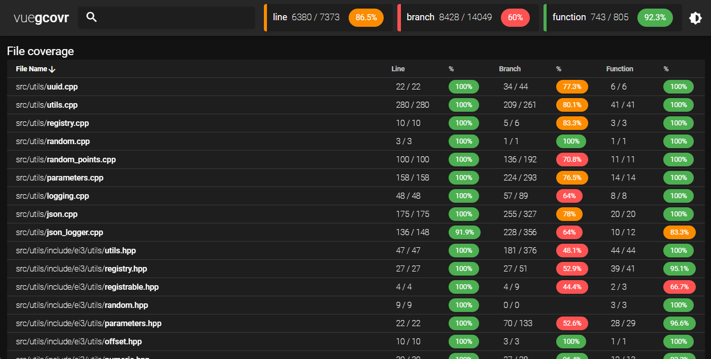

# vue-gcovr

## Overview

Attempt to display json summary generated by `gcovr` (5.x+) using a single html file (`vuejs` & `vutify`).

## Usage

Copy the `index.html` file in the same place you created the coverage summary (`coverage-summary.json`), then server this folder with any http/https web-server (python/nodejs/nginx/...).

Example:

```bash
# generate coverage file
gcovr -r . --json-summary=coverage-summary.json

# serve the current folder
python3 -m http.server -d .
```

Now open : http://0.0.0.0:8000/

You should see something like:

